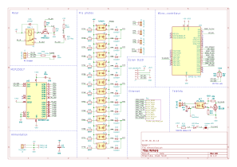
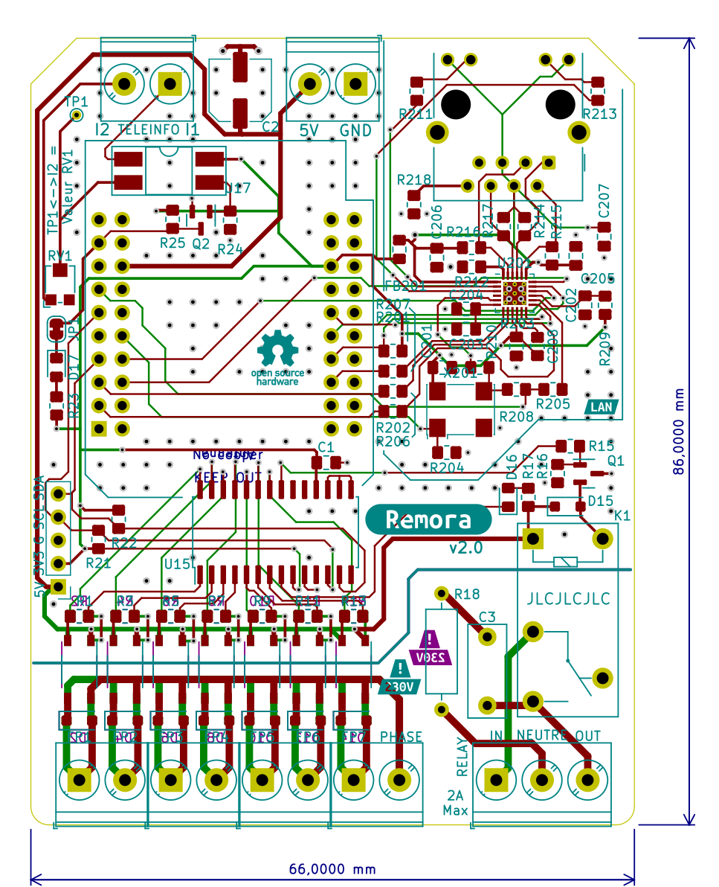
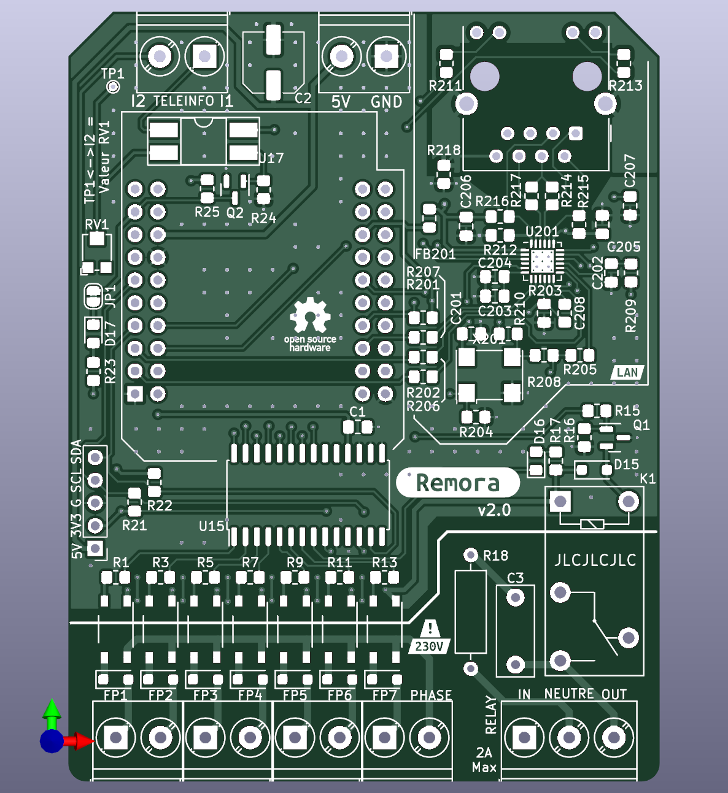
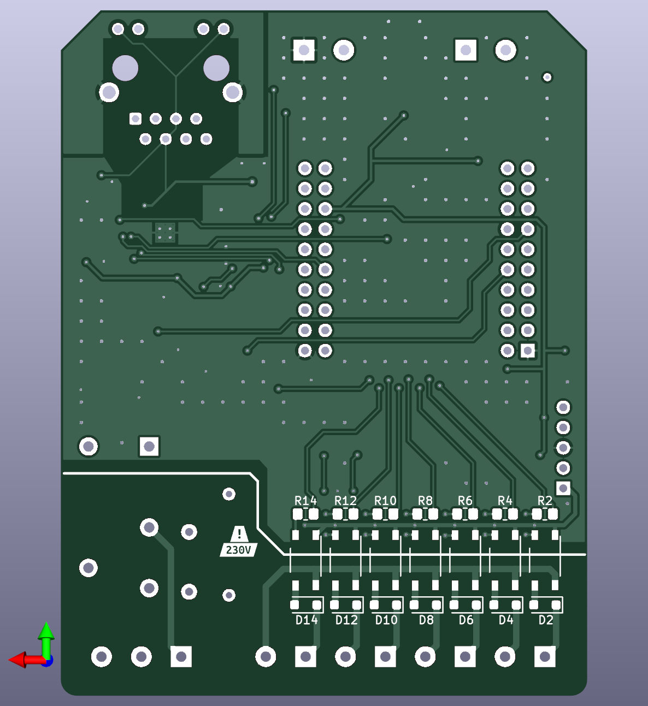
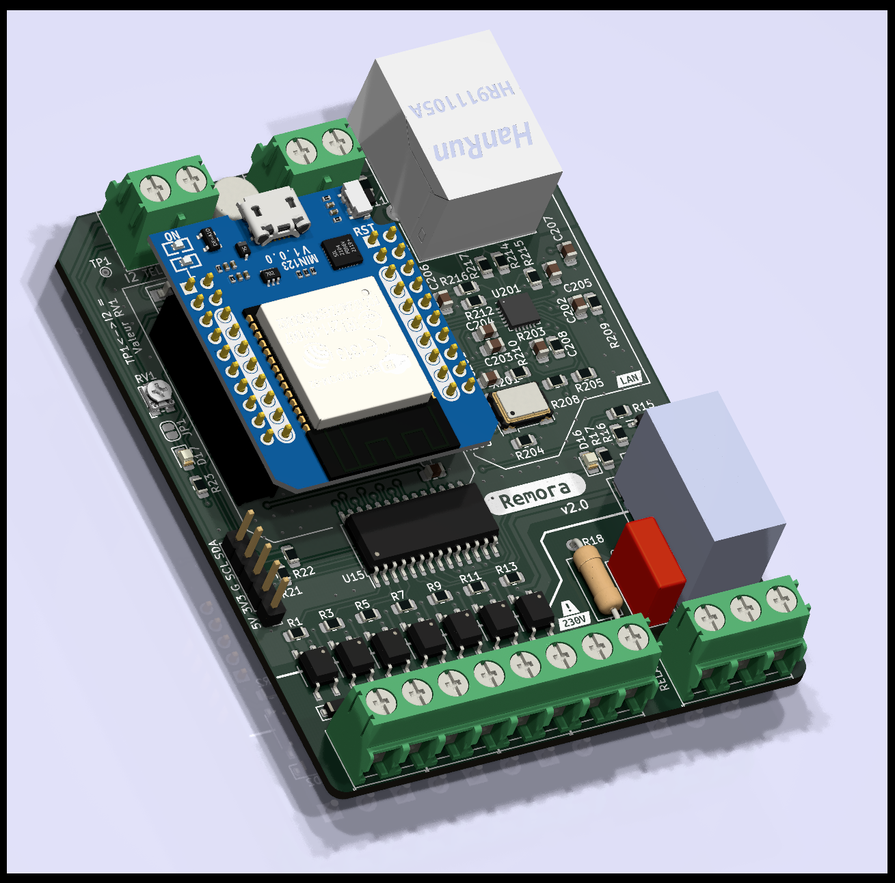
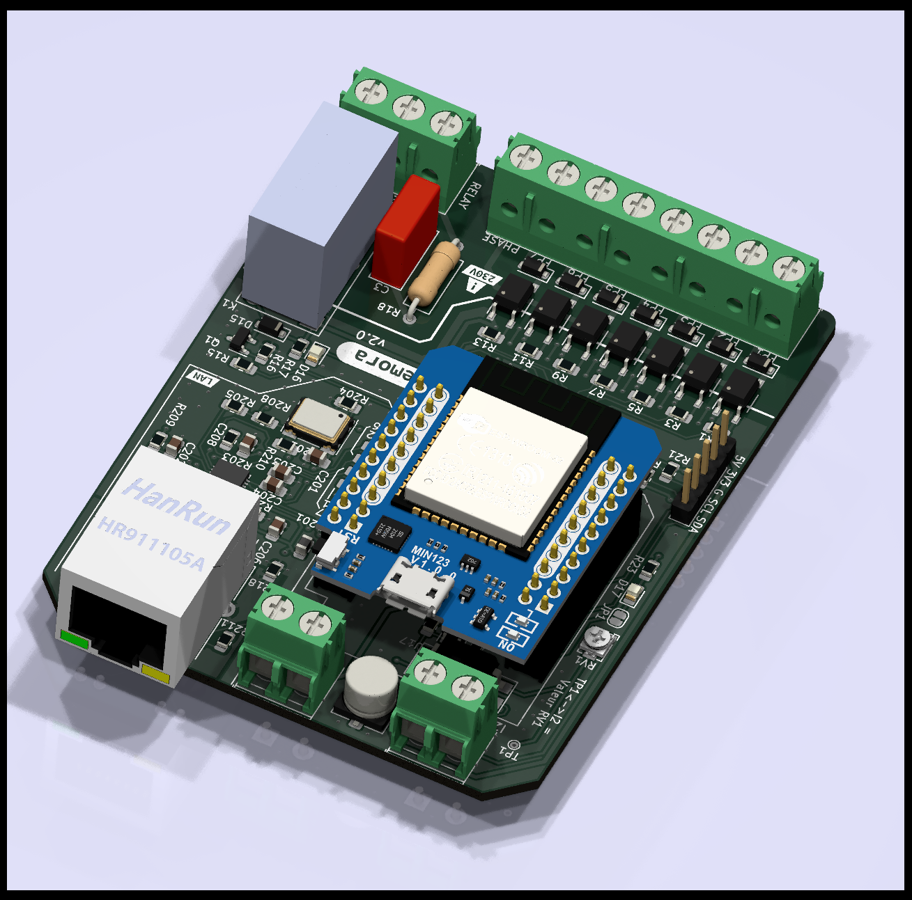
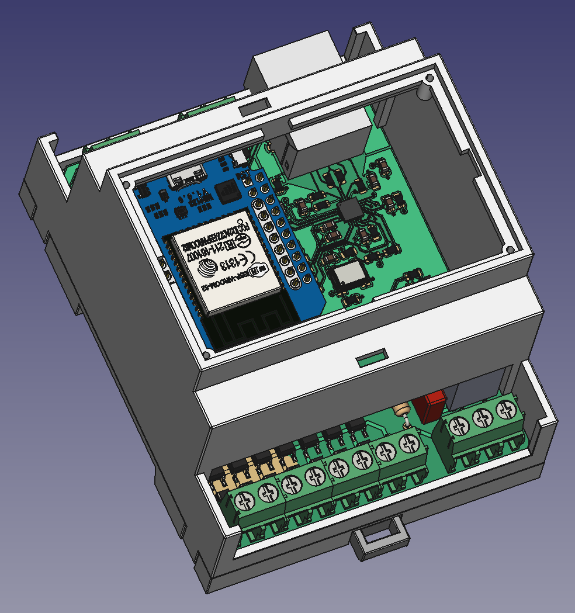
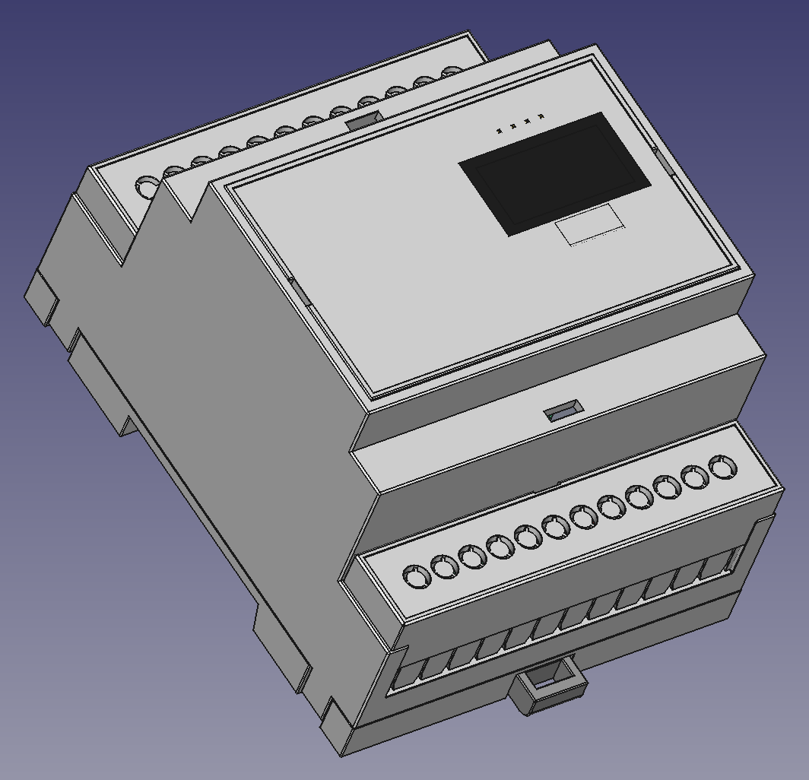

Remora
======

Contrôleur fil pilote permettant de contrôler 7 zones et un relai.

Basé sur ESP32 et ESPHome.

Version 2.0 de Remora basé sur https://github.com/tducret/programmateur-fil-pilote-wifi/tree/master

Fonctionnalités
---------------

 * ESP32 Mini D1
 * MCP23017 pour le contrôle des 7 zones et du relai
 * Port ethernet optionnel
 * Connecteur I2C pour ecran OLED
 * Relai permettant le contrôle d'un connecteur heures pleines/creuses
 

Changements depuis la version 1.3
---------------------------------

 * Ajout
   - Ajout d'un condensateur 47u en entrée pour filtrage
   - Port Ethernet (optionnel)
   - Snubber RC pour maximiser la durée de vie du relai
   - LED "relai" indépendante

 * Modification
   - Base ESP32 D1 mini
   - MCP23017 en SMD pour gain de place
   - Téléinfo basée sur Denky D4 avec résistance variable et LED
   - Nouvelle ref opto fils pilotes TLP267J
   - Nouvelle ref relai G5Q-1 (mécanique moins cher SSR) 
   
 * Suppression
   - récepteurs sans fils 433 et 868Mhz
   - connecteurs SPI et Groove I2C
   - LED 3mm RGB

   
Les composants SMD (hors partie LAN) sont prévus pour être soudés au fer.

Schématique
-----------

Board
-----

Case
----

